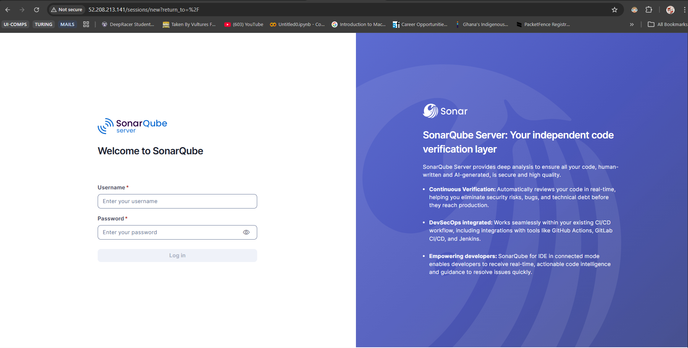

# 🚀 DevOps Lab: The "No-SSH" Revolution with Terraform & Ansible

Forget everything you know about standard SSH keys and port 22 open to the world. This project deploys a **SonarQube** server on AWS using a **fully SSM-powered architecture**.

We are talking about **Ansible provisioning over AWS Systems Manager (SSM)**. No opened SSH ports. No bastion hosts. No key management headaches. Just pure, secure, cloud-native magic. 🌩️✨



## 🤯 Why This is Wild

Most tutorials tell you to open port 22 or mess with keys. **Not here.**

We leverage the **Ansible AWS SSM connection plugin** to inject commands directly into the EC2 instance via the AWS magic backbone.
- 🚫 **Port 22 is CLOSED.** Inaccessible from the internet.
- 🔒 **IAM Roles** handle the auth, not PEM keys.
- 📦 **S3 Buckets** acting as the silent transport layer for your playbooks.

It's secure, it's robust, and it's how modern cloud engineering should be done.

## 🏗️ Architecture

The solution deploys the following stack:

- **Infrastructure (Terraform)**
  - AWS VPC & Networking components
  - EC2 Instance (Amazon Linux 2023)
  - **The Secret Sauce:** IAM Instance Profile with `AmazonSSMManagedInstanceCore`
  - **The Transport:** S3 Bucket for SSM file transfer
  - Security Groups (Only HTTP/80 allowed! 🛑 No SSH!)
  
- **Configuration (Ansible)**
  - **Connection:** `aws_ssm` (The star of the show)
  - **Docker**: Container runtime
  - **SonarQube**: Code quality and security tool
  - **Nginx**: Reverse proxy serving SonarQube

## 📂 Project Structure

```bash
.
├── ansible/                # Configuration Management
│   ├── roles/              # Ansible Roles
│   │   ├── docker/         # Installs Docker & Python SDK
│   │   ├── nginx/          # Configures Nginx Reverse Proxy
│   │   └── sonarqube/      # Deploys SonarQube Container
│   ├── inventory.yml       # Generated by Terraform
│   └── site.yml            # Main Playbook
├── infra/                  # Infrastructure as Code
│   ├── modules/            
│   │   ├── compute/        # EC2 Deployment
│   │   ├── networking/     # VPC & Subnets
│   │   ├── security/       # IAM & Security Groups
│   │   └── storage/        # S3 for SSM
│   ├── main.tf             # Entry point
│   └── variables.tf        # Configuration variables
└── assets/                 # Project assets & images
```

## 🚀 Getting Started

### Prerequisites

You need the gear to handle this setup:
- [Terraform](https://www.terraform.io/) (v1.0+)
- [Ansible](https://docs.ansible.com/ansible/latest/installation_guide/index.html) (Core 2.12+)
- [AWS CLI](https://aws.amazon.com/cli/) (v2) - **Logged in and ready**
- **[AWS Session Manager Plugin](https://docs.aws.amazon.com/systems-manager/latest/userguide/session-manager-working-with-install-plugin.html)** (Crucial! Without this, the magic fails)

### 1. Provision the Infrastructure

Spin up the silent infrastructure.

```bash
cd infra
terraform init
terraform apply
```

*Terraform will build the stage and wire up the IAM roles that make the SSM connection possible. It generates the `ansible/inventory.yml` pointing to a specific S3 bucket for command transport.*

### 2. The Ansible "Beam Me Up" 🛸

Run the playbook. Watch as Ansible connects *without* SSH keys.

```bash
cd ../ansible
ansible-playbook site.yml
```

*Look ma, no keys!* Ansible uses the `aws_ssm` connection plugin to execute tasks directly on the instance via the SSM agent.

## 🧪 Accessing SonarQube

Once the deployment is complete, access SonarQube in your browser:

```
http://<EC2-PUBLIC-IP>
```

- **Default credentials**: `admin` / `admin` (You will be prompted to change these on first login).

## 🔧 Configuration Details

- **SonarQube Image**: `sonarqube:community`
- **Docker Network**: Host mode mapped via Nginx
- **Nginx Port**: 80 -> Proxies to SonarQube:9000
- **System Tuning**: Automatically sets `vm.max_map_count` required for Elasticsearch (embedded in SonarQube).

## ⚠️ Troubleshooting

**Issues with Ansible SSM Connection:**
If the magic fails, it's usually credentials or the plugin.

1. **Check Credentials:** `aws sts get-caller-identity`
2. **Check Plugin:** Make sure `session-manager-plugin` is installed on YOUR machine.
3. **Check Target:** The EC2 instance needs a few minutes to boot and register with SSM. Give it a moment to wake up.

**Python/Docker Weirdness:**
We handle the installation of the Docker SDK for Python automatically. If you see pip errors, remember we are running in a constrained environment via SSM, not a full shell session!
